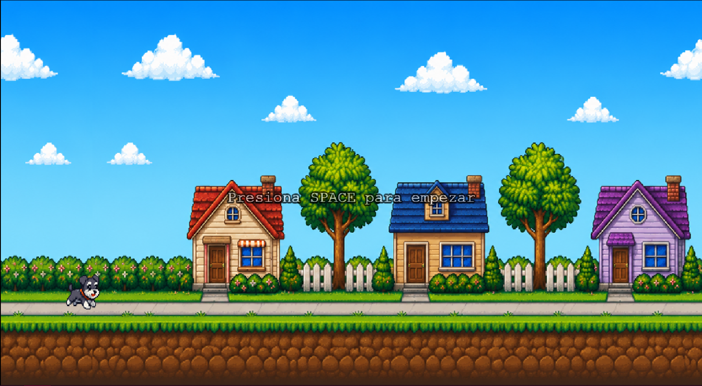
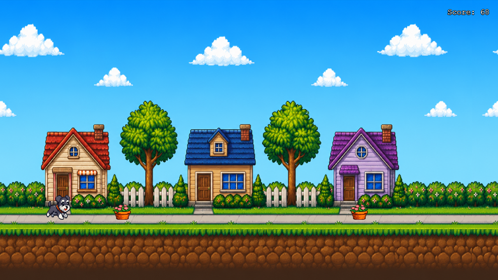
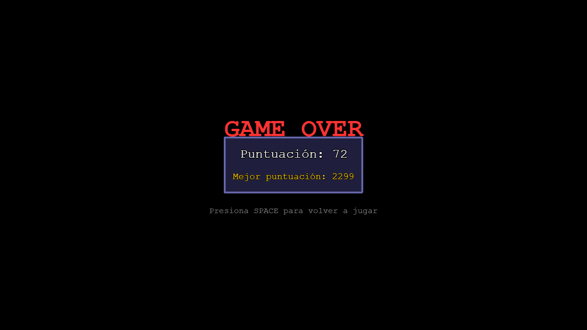

# Caramelito Run

Caramelito Run es un videojuego 2D del género endless runner desarrollado con Phaser 3. El jugador controla a Caramelito, quien corre automáticamente a través de un escenario residencial mientras debe esquivar distintos obstáculos saltando en el momento adecuado. La dificultad aumenta progresivamente conforme transcurre la partida.

## Gameplay


## Capturas

<p align="center">
  
  
  
</p>

## Objetivo y Mecánicas

El objetivo del juego es sobrevivir el mayor tiempo posible. El jugador controla a Caramelito, un personaje que corre automáticamente por un escenario residencial. Debe saltar para evitar obstáculos que aparecen en el camino.

- **Puntuación**: Se calcula como `segundos sobrevividos × 10`
- **High Score**: Se guarda en localStorage y se muestra en la pantalla de Game Over
- **Dificultad progresiva**: La velocidad de los obstáculos y la frecuencia de aparición aumentan con el tiempo

## Tecnologías

- **Phaser 3** — Framework de juegos HTML5
- **Arcade Physics** — Sistema de física integrado en Phaser
- **JavaScript ES2023** — Sin TypeScript
- **HTML5 Canvas** — Renderizado del juego

## Requisitos

- Node.js (LTS recomendado)
- Un navegador moderno con soporte para HTML5 y WebGL

## Instalación

1. Instalar Node.js desde https://nodejs.org

2. Clonar el repositorio
```bash
   git clone https://github.com/alarconkarina/caramelito-run.git
   cd caramelito-run
   ```


## Cómo Ejecutar

El juego requiere un servidor HTTP local para cargar los assets correctamente. Abrirlo como archivo directo en el navegador no funciona.

Posicionado en el directorio de la carpeta `caramelito-run` usa `npx` para levantar un servidor estático sin necesidad de instalar nada:

```bash
npx serve . -p 3000
```

Luego abrir http://localhost:3000 en el navegador.

## Controles

| Tecla | Acción |
|-------|--------|
| `SPACE` | Iniciar juego / Saltar |

## Arquitectura del Proyecto

```
caramelito-run/
├── index.html              # Punto de entrada
├── src/
│   ├── main.js             # Configuración de Phaser
│   ├── objects/            # Objetos del juego
│   │   ├── Player.js       # Jugador (movimiento, salto, animaciones)
│   │   ├── Obstacle.js     # Obstáculos (gato, maceta, tacho)
│   │   └── Background.js   # Fondo con scroll infinito
│   └── scenes/             # Escenas de Phaser
│       ├── BootScene.js    # Precarga de assets
│       ├── GameScene.js    # Lógica principal del juego
│       └── GameOverScene.js# Pantalla de Game Over
├── assets/
│   ├── sprites/            # Sprites del juego
│   └── sounds/             # Efectos de sonido
└── docs/
    └── images/             # Imagenes del README
```

### Scenes

| Escena | Responsabilidad |
|--------|----------------|
| **BootScene** | Precarga todos los assets (sprites, sonidos). Inicializa el high score en localStorage. Transiciona a GameScene. |
| **GameScene** |Gestión del estado del juego (inicio, activo, game over). Spawn de obstáculos. Colisiones. Sistema de puntuación. Dificultad progresiva. |
| **GameOverScene** | Muestra puntuación final y high score. Permite reiniciar el juego. |

### Objects

| Objeto | Responsabilidad |
|--------|----------------|
| **Player** | Sprites del jugador, animaciones (run/jump), física de salto (solo si está en el suelo), hitbox personalizada, reproducción de sonido de salto. |
| **Obstacle** | Tipos de obstáculo (gato, maceta, tacho), movimiento horizontal hacia la izquierda, destrucción cuando sale de pantalla. |
| **Background** | Fondo residencial con scroll infinito usando TileSprite. |

## Sistema de Juego

### Movimiento del Jugador

El jugador no se mueve horizontalmente. El fondo y los obstáculos se mueven hacia la izquierda para crear la ilusión de movimiento.

### Salto

- **Velocidad de salto**: -500 (hacia arriba)
- **Gravedad**: 1200
- **Condición**: Solo puede saltar cuando está tocando el suelo (`body.blocked.down`)
- **Tecla**: SPACE

### Animaciones

El spritesheet del jugador contiene 5 frames:
- Frames 0-3: Animación de carrera (loop)
- Frame 4: Animación de salto (static)

### Generación de Obstáculos

Los obstáculos se generan aleatoriamente de tres tipos:
- **obstacle_cat** — Gato (64×64)
- **obstacle_pot** — Maceta (48×48)
- **obstacle_trash** — Tacho de basura (64×64)

El spawn se controla con `Phaser.Time.TimerEvent` que se reprograma después de cada obstáculo con un delay dinámico.

### Colisiones

- Sistema de física: **Arcade Physics**
- Tipo de colisión: **overlap** entre jugador y obstáculos
- Cuando ocurre un overlap, se ejecuta el callback `onHit`, iniciando la secuencia de Game Over.

### Puntuación

```javascript
score = Math.floor(survivalTimeInSeconds * 10)
```

El score se actualiza en tiempo real durante el juego.

### Game Over

1. Se reproduce el sonido de game over
2. Se detiene el spawn de obstáculos
3. Se detiene el movimiento del fondo
4. Se guarda el high score en localStorage
5. Después de 2 segundos, se transiciona a GameOverScene

### High Score

Se almacena en `localStorage` con la clave `caramelito_highscore`. Se inicializa en `0` si no existe.

### Sonidos

| Sonido | Archivo | Descripción |
|--------|---------|-------------|
| Jump | `jump.wav` | Se reproduce al saltar (opcional) |
| Game Over | `gameover.wav` | Se reproduce al chocar (opcional) |

Los sonidos son opcionales y fallan silenciosamente si no están disponibles.

### Dificultad Progresiva

La dificultad aumenta progresivamente en función del tiempo sobrevivido.

- La velocidad de los obstáculos incrementa gradualmente.
- La frecuencia de aparición aumenta hasta un límite mínimo para mantener el juego equilibrado.

## Gestión de Assets

Los assets se cargan en BootScene mediante `this.load`:

| Tipo | Método | Archivos |
|------|--------|----------|
| Spritesheet | `load.spritesheet()` | caramelito_run.png (64×64, 5 frames) |
| Imágenes | `load.image()` | obstacle_*.png, bg_residential.png |
| Audio | `load.audio()` | jump.wav, gameover.wav |

Todos los assets están en carpetas organizadas:
- `assets/sprites/` — Gráficos del juego
- `assets/sounds/` — Efectos de sonido

## Mejoras Futuras

- [ ] Nuevos escenarios
- [ ] Nuevas animaciones (personalizacion del personaje, obstaculos, etc.)
- [ ] Sistema de pausa
- [ ] Menú principal
- [ ] Pantalla de configuración.
- [ ] Compatibilidad con dispositivos móviles.
- [ ] Implementar power-ups (escudo, puntuación bonus)
- [ ] Sistema de logros (achievements)
- [ ] Modo de dos jugadores local


## Licencia

Licencia pendiente de definir.
